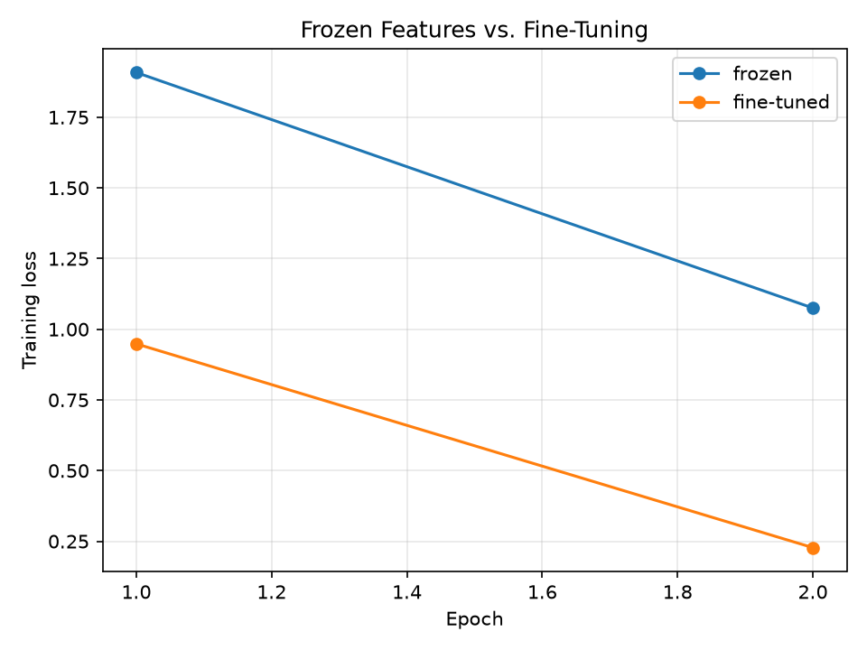

# Deep Learning Homework 3

## Question 1: Implement 2-D Convolution

`Q1_Implement_2D_Convolution.py` stores the assignment's input and 3 x 3 filter as NumPy arrays. It slides the filter over the input with valid padding, computes the dot product at each location, and prints the feature map and output shape. The default stride is 1; pass `--stride 2` to see how a larger stride reduces the number of output positions.

Run from this folder:

```bash
./run_q1_convolution.sh
./run_q1_convolution.sh --stride 2
```

The Q1 launcher checks for NumPy and installs it with the selected Python if it is missing.

Expected output with the default stride of 1:

```text
Stride: 1
Output feature map:
[[4 3 4]
 [2 4 3]
 [2 3 4]]
Output shape: (3, 3)
With stride 2, the filter moves two positions at a time, so it evaluates fewer locations; for this input the output shape is (2, 2) instead of (3, 3).
```

## Question 2: Transfer Learning, Freeze vs. Fine-Tune

`Q2_Transfer_Learning_Freeze_vs_Fine_Tune.py` compares two ResNet-18 experiments on the CIFAR-10 image-classification dataset.

- **Frozen feature extractor:** keeps pretrained convolutional layers fixed and trains only the new classifier.
- **Fine-tuned network:** also trains the final convolutional block and the new classifier.

This is a standard transfer-learning setup. A pretrained ResNet model has already learned general visual features such as edges, corners, object shapes, and textures. In the frozen setup, the base model is treated as a fixed feature extractor, while a new classifier learns to map those features to the target classes. In fine-tuning, the higher-level convolutional layers are unfrozen so they can adapt to the new dataset and task.

### Experiment A — Feature Extraction
- Load the pretrained network.
- Freeze the convolutional/base layers.
- Replace the final classification layer.
- Train only the new classifier.

### Experiment B — Fine-Tuning
- Start with the pretrained network.
- Unfreeze at least the last convolutional block.
- Train the unfrozen layers and classifier.

### For both experiments:

a. Report the number of trainable parameters.

b. Train for the same number of epochs.

c. Record training time.

d. Report test or validation accuracy.

e. Plot training loss.

f. Compare the two approaches in a table.

| Method | Trainable Parameters | Training Time | Accuracy |
|---|---:|---:|---:|
| Frozen Feature Extractor | 5,130 | 10.12 s | 74.00% |
| Fine-Tuned Network | 8,398,858 | 22.43 s | 81.00% |

The training loss plot is shown below.



### Example output from a successful run

```text
Device: mps
Downloading CIFAR-10 and pretrained ResNet-18 weights on the first run if needed.
Using cached CIFAR-10 dataset in local data folder.
frozen: epoch 1/2, loss=1.9082
frozen: epoch 2/2, loss=1.0751
fine-tuned: epoch 1/2, loss=0.9483
fine-tuned: epoch 2/2, loss=0.2275

Comparison (same dataset subset and number of epochs):
| Method | Trainable parameters | Training time (s) | Test accuracy |
|---|---:|---:|---:|
| frozen | 5,130 | 10.12 | 74.00% |
| fine-tuned | 8,398,858 | 22.43 | 81.00% |
Training-loss plot saved to q2_training_loss.png
```

### Discussion
The frozen model has far fewer trainable params, so it learns much faster and it cost less compute. The fine-tuned model has more trainable weight and can adapt to the target dataset, which often improves accuarcy. In this case, the fine-tuned model reach higher accuracy and a lower training loss. This is because the lower level features from the pretrained network are useful, but the higher level filters still need to adapt to CIFAR-10 specifc patterns. Freezing too many layers prevents that adaption, while fine-tuning allows the network to refine its feature representatons for the task.

g. In 5-8 sentences, discuss the results. Explain why freezing layers and fine-tuning layers may produce different training times and performance.

The results show that the frozen feature extractor trains faster because only a small classifier is updated. It also has fewer trainable parameters, so its computation is much lighter. The fine-tuned model updates millions of pretrained weights, which makes training slower but lets it adapt better to CIFAR-10. This usually leads to lower training loss and higher test accuracy, as seen in the example. Freezing works well when the source and target tasks are similar and the pretrained features are already strong. Fine-tuning is better when the dataset is different enough that the higher layers need to be adjusted. The difference in performance comes from the balance between feature reuse and task-specific adaptation.

### Run commands

```bash
./run_q2_transfer_learning.sh
./run_q2_transfer_learning.sh --epochs 3 --train-limit 2000 --test-limit 1000
```

The Q2 launcher creates a separate `.venv-q2` environment and installs PyTorch, torchvision, and matplotlib there if needed. On Intel Macs it uses Python 3.11 with PyTorch 2.2.2 and torchvision 0.17.2, since compatible wheels are not available for Python 3.13. The first run requires internet access to install dependencies and download the CIFAR-10 dataset and pretrained ResNet-18 weights. Training uses CUDA or Apple Metal (MPS) when available, otherwise it runs on the CPU.

This task is a good example of transfer learning because the pre-trained model already knows basic visual pattens. The frozen method is efficient, while fine-tuning yields better performance when enough data and compute are available. The final result show that using a pretrained backbone can reduce training time and increase accuracy compared with training a model from scratch.
